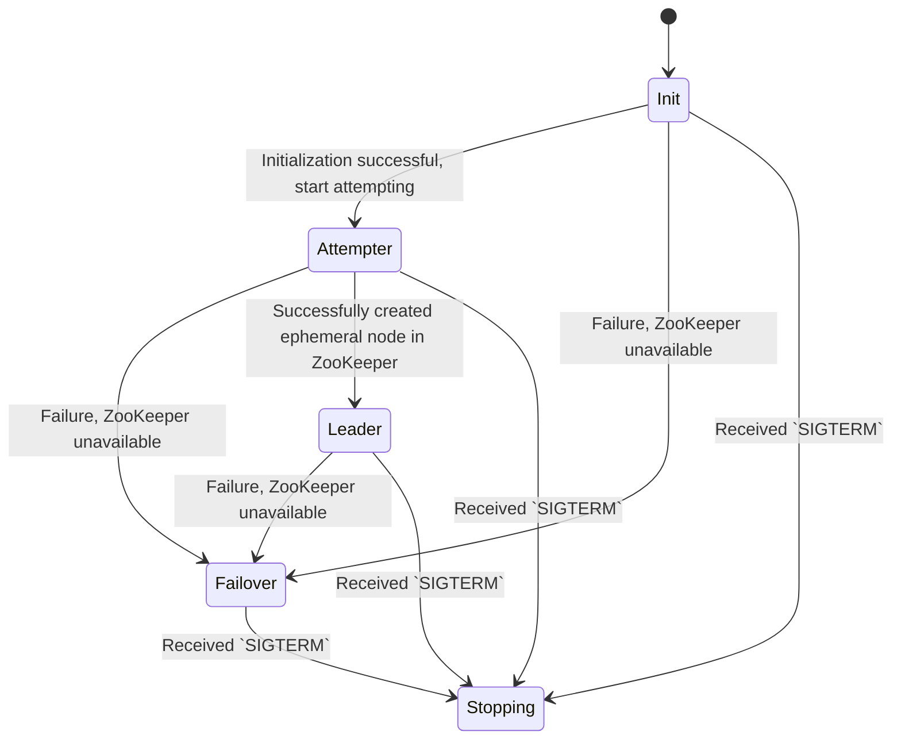

# Project Overview
This project implements a distributed leader election service using ephemeral nodes in ZooKeeper. The service is designed to run in multiple replicas, with each replica competing to become the leader. The leader is responsible for periodically writing a file to a specified directory and managing the storage capacity by deleting old files if necessary. The service operates as a state machine with the following states:

- `Init` - Initialization begins, checking the availability of all resources
- `Attempter` - Trying to become a leader - once in `attempter-timeout` we try to create an ephemeral node in zookeeper
- `Leader` - Became a leader, need to write a file to disk (simulation of useful activity)
- `Failover` - Something is broken, the app is trying to self-recover
- `Stopping` - Graceful shutdown - a state in which an application releases all its resources



## Getting Started

1. Clone repository and Install dependencies:
```bash
git clone https://github.com/yberikov/leader-election-golang/
cd leader-election-golan
go mod tidy
```

2. Build and run docker-compose
```bash
docker-compose up --build services
```


## Project Structure
The project is organized into the following directories:


```plain
.
├── README.md
├── cmd
│   └── election - main package containing the main function
└── internal
    ├── commands - contains Cobra command handlers
    │   └── cmdargs - structures for storing Cobra command arguments
    ├── depgraph - dependency graph structure, providing a DI container with lazy initialization
    └── usecases - main use cases
        └── run - use case for running the state machine
            └── states
                └── empty - example state, not used in the final service
```

## Configuration

Configuration is done via command-line flags or environment variables.

### Required Settings

zk-servers: Array of ZooKeeper server addresses.
```
--zk-servers=foo1.bar:2181,foo2.bar:2181
```
leader-timeout: Interval at which the leader writes a file to the disk.
```
--leader-timeout=10s
```
attempter-timeout: Interval at which the attender attempts to become the leader.
```
--attempter-timeout=10s
```
file-dir: Directory where the leader writes files.
```
--file-dir=/tmp/election
```
storage-capacity: Maximum number of files in the file-dir directory
```
--storage-capacity=10
```
