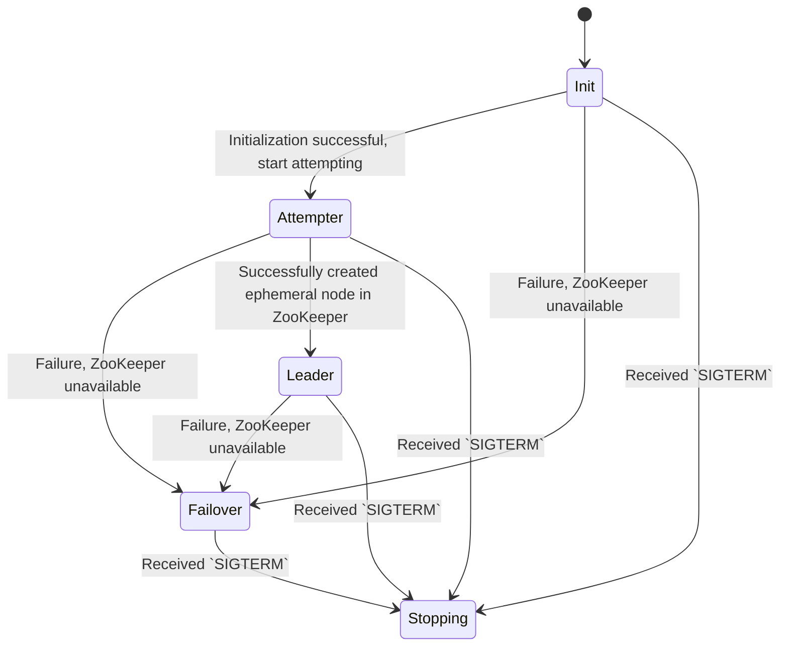

# Project Overview
This project implements a distributed leader election service using ephemeral nodes in ZooKeeper. The service is designed to run in multiple replicas, with each replica competing to become the leader. The leader is responsible for periodically writing a file to a specified directory and managing the storage capacity by deleting old files if necessary. The service operates as a state machine with the following states:

- `Init` - Начинается инициализация, проверка доступности всех ресурсов
- `Attempter` - Пытаемся стать лидером - раз в `attempter-timeout` пытаемся создать эфемерную ноду в зукипере
- `Leader` - Стали лидером, нужно писать файлик на диск(симуляция полезной деятельности)
- `Failover` - Что-то сломалось, попытка приложения починить самого себя
- `Stopping` - Graceful shutdown - состояние, в котором приложение освобождает все свои ресурсы



## Getting Started

1. Clone repository and Install dependencies:
```bash
git clone https://github.com/yberikov/leader-election-golang/
cd leader-election-golan
go mod tidy
```

2. Build and run docker-compose
```bash
docker-compose up --build services
```


## Project Structure
The project is organized into the following directories:


```plain
.
├── README.md
├── cmd
│   └── election - main package containing the main function
└── internal
    ├── commands - contains Cobra command handlers
    │   └── cmdargs - structures for storing Cobra command arguments
    ├── depgraph - dependency graph structure, providing a DI container with lazy initialization
    └── usecases - main use cases
        └── run - use case for running the state machine
            └── states
                └── empty - example state, not used in the final service
```

## Configuration

Configuration is done via command-line flags or environment variables. Environment variables are derived from the flag names by converting them to uppercase, replacing dashes with underscores, and prefixing with ELECTION_.

Required Settings
zk-servers ([]string): Array of ZooKeeper server addresses. Example: --zk-servers=foo1.bar:2181,foo2.bar:2181
leader-timeout (time.Duration): Interval at which the leader writes a file to the disk. Example: --leader-timeout=10s
attempter-timeout (time.Duration): Interval at which the attender attempts to become the leader. Example: --attempter-timeout=10s
file-dir (string): Directory where the leader writes files. Example: --file-dir=/tmp/election
storage-capacity (int): Maximum number of files in the file-dir directory. Example: --storage-capacity=10

